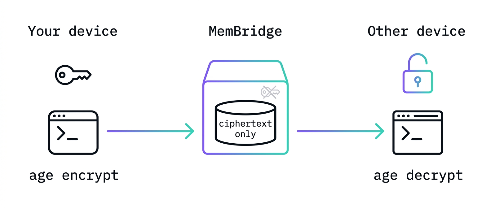

# MemBridge


Shared encrypted memory context for local IDEs, CLI tools, and browser-based AI chats, exposed as a standard MCP server.

Open source and self-hostable — or skip the setup and use the **free hosted instance** at
[membridge.yaro.fr](https://membridge.yaro.fr/auth/github) (sign in with GitHub, no credit card, no setup).

The bash CLI (`push`/`pull`) is genuinely end-to-end encrypted — your age key never leaves your machine.
MCP tool calls (used by AI assistants and browser chats) send the key as a call argument over TLS so the
server can decrypt on your behalf; this is necessary because browser contexts lack a local shell to run `age`
directly. The key is never persisted server-side, but for MCP calls it is *not* zero-knowledge.



- 🌐 Landing page / overview: https://tidymaze.github.io/membridge/
- 🚀 Deployment guide: [DEPLOYMENT.md](./DEPLOYMENT.md)
- 📋 Full spec: [CLAUDE.md](./CLAUDE.md)

## Quickstart

**Hosted (no setup):** sign in at https://membridge.yaro.fr/auth/github and you're done.

**Self-host:**

```bash
cp .env.example .env   # set GH_CLIENT_ID / GH_CLIENT_SECRET / BASE_URL
docker compose up -d --build
curl http://localhost:3000/health
```

## CLI install

The CLI has no npm/bun deps — just `curl` and `age` (`brew install age`).

```bash
curl -fsSL https://membridge.yaro.fr/install | bash

# configure (after signing in at membridge.yaro.fr/auth/github)
memb configure mem_<your-key>
```

## Claude Code hook — auto-push on session end

Add to `~/.claude/settings.json` to push your context every time a Claude Code session stops:

```json
{
  "hooks": {
    "Stop": [
      { "hooks": [{ "type": "command", "command": "memb push --silent 2>/dev/null || true" }] }
    ]
  }
}
```

`memb push --silent` suppresses output so the hook doesn't pollute the terminal.

## Connect to Claude Code (MCP)

```bash
claude mcp add --transport http membridge https://membridge.yaro.fr/mcp
```

Then in a Claude Code session you can call `get_context`, `add_note`, and `search` — pass your age key
(`AGE-SECRET-KEY-...` from `~/.memory/key.txt`) as the `age_key` argument each time.

> **Note:** MCP tools only work inside an interactive Claude Code session. Subprocesses launched via
> `claude -p` do not inherit the parent session's MCP authentication.

## Connect to Gemini / Antigravity IDE (MCP)

MemBridge is fully compatible with Gemini / Antigravity IDE via standard MCP SSE transport. 

Add the server configuration to your `~/.gemini/config/mcp_config.json` file:

```json
{
  "mcpServers": {
    "membridge": {
      "url": "https://membridge.yaro.fr/mcp",
      "headers": {
        "Authorization": "Bearer mem_<your-key>"
      }
    }
  }
}
```

Once configured, the tools `get_context`, `add_note`, and `search` will be available directly within your Gemini / Antigravity chat workspace.

### Unsupported Features
*   **Gemini Web (`gemini.google.com`)**: Does NOT support custom third-party MCP connections due to browser-level sandboxing and CORS limitations.
*   **Antigravity Session-End Hook**: Antigravity runs as a continuous, stateful IDE developer agent rather than a command-line session, so there is no equivalent to Claude Code's shell `Stop` hook. Pushes must be run manually (`memb push`).

## Tests

```bash
# start a local Postgres for tests (ephemeral, in-memory)
docker compose -f docker-compose.test.yml up -d
# apply schema once
docker compose -f docker-compose.test.yml exec postgres-test \
  psql -U membridge -d membridge_test -f src/db/schema.sql

# run all tests (unit + E2E round-trip)
bun test
```

The E2E suite (`test/e2e.test.ts`) exercises the full round-trip with real `age` encryption:
CLI push → MCP `get_context`, MCP `add_note` → CLI pull, wrong-key rejection, `search`.
